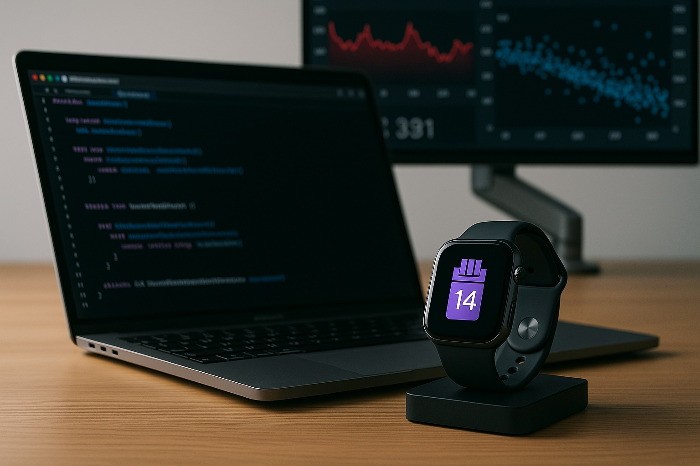
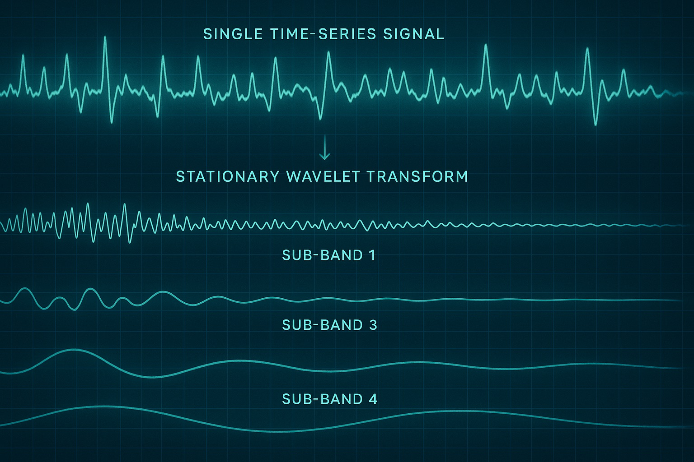

The idea of truly understanding our habits, especially those we perform almost unconsciously, has always fascinated me. What if our wearables could offer a gentle, non-judgmental mirror to these patterns? This question sparked the "Still Mirror" project: an attempt to passively detect smoking or vaping events using the rich physiological data from an Apple Watch, without requiring manual input from the user. This is not about building another cessation app, but rather a tool for pure, unadulterated awareness.

## The Challenge: A Whisper in a Symphony of Noise

The core challenge is immense: how do you distinguish the subtle physiological signature of a smoking/vaping event from the myriad of other daily activities and bodily responses? Stress, a brisk walk, a startling noise, or even a cup of coffee can all cause transient changes in heart rate (HR) and heart rate variability (HRV). The signal we're looking for is often a whisper in a symphony of physiological noise.

My previous explorations in this area, documented in a [Business Requirements Document for Still Mirror](/still-mirror-brd-passive-monitoring-apple-watch/) and a detailed pseudo-code for a [Multi-Vector Physiological Signature (MVPS) algorithm](/still-mirror-neurocardio-signature-algorithm-apple-watch/), laid the groundwork. But to truly isolate these fleeting events, I needed a more sophisticated signal processing technique.

<figure>
  
  <figcaption>Fig 1. – The Apple development ecosystem: Xcode, Swift, and HealthKit are central to bringing 'Still Mirror' to life on the Apple Watch.</figcaption>
</figure>

## Choosing the Toolkit: Apple Ecosystem & Swift

For a project targeting the Apple Watch, the ecosystem choice is clear:
*   **Xcode and Swift:** The native development environment for Apple platforms. Embarking on this meant diving deeper into Swift, a language I find elegant and powerful, and navigating the intricacies of Xcode.
*   **HealthKit:** Apple's framework is the gateway to the essential data streams: heart rate, HRV (SDNN/RMSSD), SpO2 (especially relevant for combustion vs. vaping), and activity levels. The privacy-centric design of HealthKit is paramount for an app handling such sensitive data.
*   **watchOS Limitations:** Developing for the watch means constantly balancing functionality with resource constraints – battery life and background processing capabilities are always top of mind.

## The Algorithmic Heart: Stationary Wavelet Transform (SWT)

Traditional time-series analysis often struggles with non-stationary signals – signals whose statistical properties (like mean and variance) change over time. Physiological data is notoriously non-stationary. This is where the **Stationary Wavelet Transform (SWT)** comes into play.

Unlike the standard Discrete Wavelet Transform (DWT) which is shift-variant (meaning a small shift in the input signal can dramatically change the wavelet coefficients), SWT is shift-invariant. This makes it more robust for analyzing signals where the exact timing of events is crucial but can vary slightly.

**Why SWT for this problem?**

1.  **Time-Frequency Localization:** SWT can decompose a signal into different frequency bands while preserving temporal information. This means we can look for specific frequency characteristics (e.g., sudden bursts of high-frequency activity in HR, or specific changes in HRV frequency bands) that occur at precise moments.
2.  **Denoising:** Physiological signals are noisy. SWT can help separate the underlying "true" signal from random noise by analyzing wavelet coefficients at different scales.
3.  **Transient Event Detection:** It's particularly good at identifying abrupt changes, spikes, or transient events in a signal, which is exactly what we might expect from the acute physiological response to nicotine intake.

<figure>
  
  <figcaption>Fig 2. – Visualizing the Stationary Wavelet Transform decomposing a signal into its constituent frequency components over time, aiding in pattern detection.</figcaption>
</figure>

In essence, SWT acts like a sophisticated set of filters, allowing us to "see" patterns in the HR, HRV, and potentially SpO2 data that might be obscured by noise or long-term trends. We can look for characteristic "shapes" or energy changes in specific wavelet sub-bands that correspond to the physiological jolt.

## The Development Journey: From Data to Detection

1.  **Data Collection (HealthKit):** Setting up reliable background data fetching from HealthKit, respecting user permissions and handling data updates efficiently.
2.  **Signal Preprocessing:** Cleaning the incoming HR, HRV, and SpO2 data. This includes handling missing data points and perhaps some initial filtering before applying SWT.
3.  **SWT Application:** Applying the Stationary Wavelet Transform to segments of the physiological time series. This involves choosing an appropriate mother wavelet (e.g., Daubechies, Symlet) and decomposition level.
4.  **Feature Extraction from Wavelet Coefficients:** This is where the magic (and a lot of experimentation) happens. Instead of looking at raw HR/HRV values directly, we analyze the SWT coefficients. Relevant features might include:
    *   Energy in specific detail coefficient bands around the time of a suspected event.
    *   Statistical properties (variance, kurtosis) of coefficients.
    *   Cross-correlation between wavelet coefficients of different physiological signals (e.g., HR and HRV).
5.  **Detection Logic/Model:** Initially, this might be a rule-based system looking for specific patterns in the extracted wavelet features (e.g., "a significant energy spike in HR detail coefficients at scale X, coinciding with a sharp drop in energy in HRV detail coefficients at scale Y, during a period of low physical activity"). Eventually, this could evolve into a machine learning model trained on these features.
6.  **Confidence Scoring:** As outlined in my MVPS algorithm, generating a confidence score for each detected event is crucial, reflecting the strength and clarity of the signature.
7.  **watchOS App Implementation:** Running the core detection algorithm on the Apple Watch, optimizing for battery life (e.g., processing data in batches, intelligent triggering of analysis).
8.  **iOS Companion App:** For displaying the timeline of detected events, providing insights, and managing settings. Data sync via WatchConnectivity is key here.

## Health & Ethical Considerations: The "Mirror" Philosophy

It's vital to reiterate that "Still Mirror" is conceived as an *awareness tool*, not a medical device or a cessation program.
*   **Privacy First:** All processing, especially the sensitive algorithm work, should ideally happen on-device. HealthKit data access is strictly permission-based.
*   **No Judgment:** The app's interface and any insights it provides must be neutral, simply reflecting patterns without prescriptive advice or shaming.
*   **Accuracy & Transparency:** Users need to understand the app's limitations. False positives and negatives are inevitable with such complex, passive detection. Being transparent about the confidence of detections is important.
*   **User Empowerment:** The goal is to provide users with data about their own bodies and habits, empowering them to make their own informed decisions.

## Learning Swift and Navigating the Apple Ecosystem

For developers primarily from other backgrounds (like my PHP/Laravel roots), diving into Swift, SwiftUI, Xcode, and the specific constraints of watchOS development is a significant learning curve. There's a unique philosophy to Apple's frameworks. Managing app lifecycles, background tasks, HealthKit queries, and inter-device communication (WatchConnectivity) all have their specific patterns and "Apple ways" of doing things. However, the rich documentation, strong community, and the power of Swift make it a rewarding journey.

## Conclusion: The Potential of a Silent Observer

"Still Mirror" is still an exploration, a challenging endeavor to push the boundaries of what passive sensing on a consumer wearable can achieve. The Stationary Wavelet Transform offers a promising avenue for dissecting complex physiological signals and uncovering the subtle signatures we're looking for.

The journey involves not just coding in Swift and wrestling with Xcode, but also delving into signal processing theory, understanding human physiology, and carefully considering the ethical implications of such technology. Whether "Still Mirror" becomes a widely used app or remains an intricate technical exploration, the process itself is a testament to the fascinating intersection of AI, health, and personal technology. It's about trying to build that quiet, reflective surface – a still mirror – for greater self-awareness.

What are your thoughts on using advanced signal processing like SWT for passive habit detection? I'd love to hear your insights in the comments below!
