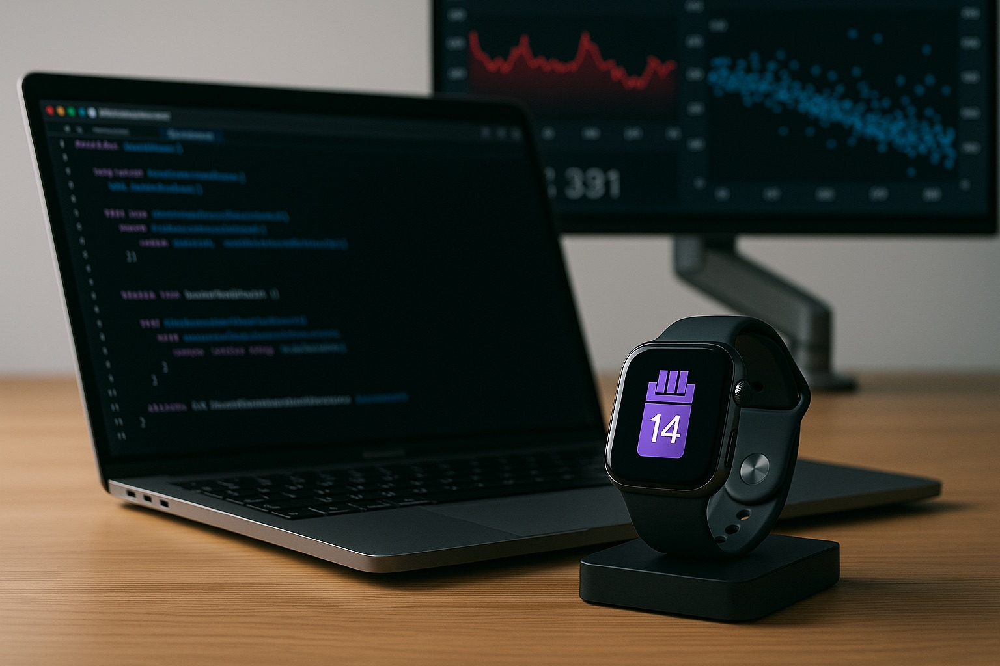
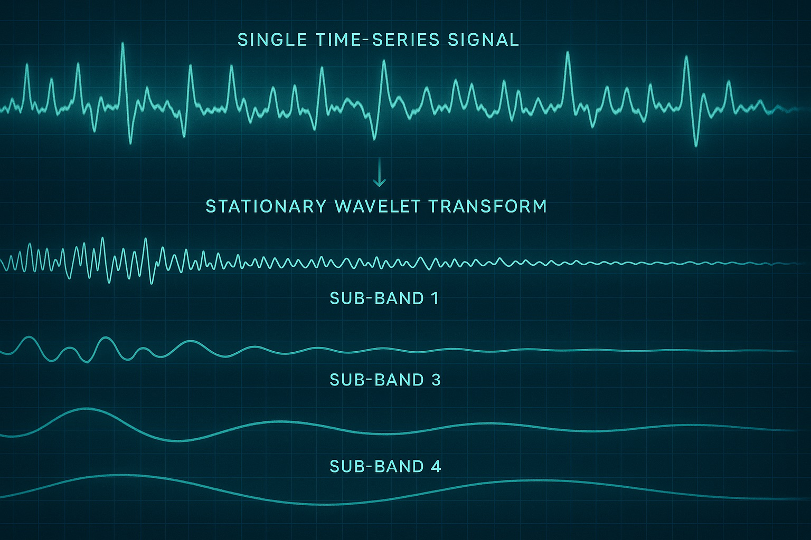

真正理解我们的习惯，尤其是那些几乎无意识完成的习惯，一直让我着迷。如果可穿戴设备能给这些模式提供一面温和、不评判的镜子，会怎样？这个问题点燃了 “Still Mirror” 项目：尝试利用 Apple Watch 丰富的生理数据，被动检测吸烟或吸电子烟事件，而不要求用户手动输入。这不是为了再做一个戒烟应用，而是一个用于纯粹、未被掺杂的觉察的工具。

## 挑战：噪声交响中的一声低语

核心挑战非常大：你怎样把一次吸烟/吸电子烟事件的细微生理特征，从无数日常活动和身体反应中区分出来？压力、快走、突如其来的噪声，甚至一杯咖啡，都可能让心率（HR）和心率变异性（HRV）短暂变化。我们要寻找的信号，常常只是生理噪声交响里的一声低语。

但要真正分离这些转瞬即逝的事件，我需要一种更精细的信号处理技术。

<figure>
  
  <figcaption>图 1. – Apple 开发生态：Xcode、Swift 和 HealthKit 是让 Still Mirror 在 Apple Watch 上活起来的核心。</figcaption>
</figure>

## 选择工具箱：Apple 生态与 Swift

对于一个以 Apple Watch 为目标的平台项目，生态选择很清楚：
*   **Xcode 和 Swift：** Apple 平台的原生开发环境。开始这个项目意味着更深入地进入 Swift——一门我觉得优雅而强大的语言——也意味着在 Xcode 的各种细节里摸索。
*   **HealthKit：** Apple 的框架是通往关键数据流的入口：心率、HRV（SDNN/RMSSD）、SpO2（对于燃烧式吸烟与电子烟的区分尤其相关）以及活动水平。对于处理如此敏感数据的应用来说，HealthKit 以隐私为中心的设计至关重要。
*   **watchOS 限制：** 为手表开发，意味着必须不断在功能和资源约束之间平衡——电池寿命和后台处理能力永远在脑子里。

## 算法的心脏：平稳小波变换（SWT）

传统时间序列分析常常难以处理非平稳信号——也就是统计性质（比如均值和方差）会随时间变化的信号。生理数据出了名地非平稳。这正是**平稳小波变换（Stationary Wavelet Transform，SWT）**派上用场的地方。

标准离散小波变换（DWT）是移位敏感的，也就是说输入信号里一个很小的时间偏移，可能会显著改变小波系数。SWT 则是移位不变的。对于那些事件发生的精确时间很关键、但又可能略有浮动的信号，它因此更稳健。

**为什么这个问题适合 SWT？**

1.  **时频定位：** SWT 可以把信号分解到不同频带，同时保留时间信息。这意味着我们可以寻找在精确时刻出现的特定频率特征，比如 HR 中突然爆发的高频活动，或者 HRV 频带中的特定变化。
2.  **去噪：** 生理信号很吵。SWT 可以通过分析不同尺度上的小波系数，帮助把底层的“真实”信号和随机噪声分开。
3.  **瞬态事件检测：** 它特别擅长识别信号中的突变、尖峰或短暂事件，而这正是尼古丁摄入后的急性生理反应可能呈现出来的东西。

<figure>
  
  <figcaption>图 2. – 可视化平稳小波变换如何把信号随时间分解为组成它的频率成分，从而帮助识别模式。</figcaption>
</figure>

本质上，SWT 像一组更精细的滤镜，让我们能够在 HR、HRV 以及潜在的 SpO2 数据中“看见”那些可能被噪声或长期趋势遮住的模式。我们可以寻找特定小波子带里的典型“形状”或能量变化，它们对应着那一下生理冲击。

## 开发旅程：从数据到检测

1.  **数据采集（HealthKit）：** 从 HealthKit 建立可靠的后台数据获取，尊重用户权限，并高效处理数据更新。
2.  **信号预处理：** 清理传入的 HR、HRV 和 SpO2 数据。这包括处理缺失数据点，也可能包括在应用 SWT 之前做一些初始滤波。
3.  **应用 SWT：** 对生理时间序列的片段应用平稳小波变换。这涉及选择合适的母小波（例如 Daubechies、Symlet）和分解层级。
4.  **从小波系数提取特征：** 魔法（以及大量实验）发生在这里。我们不直接看原始 HR/HRV 数值，而是分析 SWT 系数。相关特征可能包括：
    *   在疑似事件发生时，特定细节系数频带中的能量。
    *   系数的统计性质（方差、峰度）。
    *   不同生理信号的小波系数之间的互相关（例如 HR 和 HRV）。
5.  **检测逻辑/模型：** 一开始，这可能是一个基于规则的系统，寻找提取出的小波特征中的特定模式。例如：“在低体力活动期间，HR 细节系数在尺度 X 上出现显著能量尖峰，同时 HRV 细节系数在尺度 Y 上的能量急剧下降。”最终，它可以演进成一个用这些特征训练出来的机器学习模型。
6.  **置信度评分：** 正如我在 MVPS 算法里概述的那样，为每个检测到的事件生成置信度分数非常关键，它反映这个特征信号的强度和清晰度。
7.  **watchOS 应用实现：** 在 Apple Watch 上运行核心检测算法，并针对电池寿命优化，比如分批处理数据、智能触发分析。
8.  **iOS 配套应用：** 用于显示检测事件的时间线、提供洞察，并管理设置。这里的关键是通过 WatchConnectivity 同步数据。

## 健康与伦理考量：“镜子”哲学

必须再次强调，“Still Mirror” 被设想为一个*觉察工具*，不是医疗设备，也不是戒烟计划。
*   **隐私优先：** 所有处理，尤其是敏感的算法工作，理想情况下都应在设备本地完成。HealthKit 数据访问严格基于权限。
*   **不评判：** 应用界面以及它提供的任何洞察都必须保持中性，只是反映模式，不给处方式建议，也不羞辱用户。
*   **准确性与透明度：** 用户需要理解应用的局限。在这种复杂的被动检测里，误报和漏报不可避免。透明呈现检测的置信度很重要。
*   **赋能用户：** 目标是把关于用户自身身体和习惯的数据交给他们，让他们能做出自己的知情决定。

## 学习 Swift，并穿过 Apple 生态

对于主要来自其他背景的开发者（比如我自己的 PHP/Laravel 根系）来说，进入 Swift、SwiftUI、Xcode，以及 watchOS 开发的具体约束，是一条很明显的学习曲线。Apple 的框架有一种独特的哲学。管理应用生命周期、后台任务、HealthKit 查询和设备间通信（WatchConnectivity），都有各自特定的模式和“Apple 式”的做法。不过，丰富的文档、强大的社区，以及 Swift 本身的能力，让这段旅程很值得。

## 结论：一个沉默观察者的潜力

“Still Mirror” 仍然是一次探索，一项困难的尝试：推动消费级可穿戴设备上的被动感知能做到什么。平稳小波变换为拆解复杂生理信号、发现我们正在寻找的细微信号，提供了一条很有希望的路径。

这段旅程不只是用 Swift 写代码、和 Xcode 较劲，也包括深入信号处理理论、理解人体生理，并谨慎思考这种技术的伦理含义。无论 “Still Mirror” 最终成为一款被广泛使用的应用，还是停留为一次精密的技术探索，这个过程本身都证明了 AI、健康与个人技术交汇处有多迷人。它关乎试着建造那片安静、可反射的表面——一面 still mirror——让我们更清楚地看见自己。

你怎么看用 SWT 这样的高级信号处理来做被动习惯检测？欢迎在下面的评论里告诉我你的想法。
