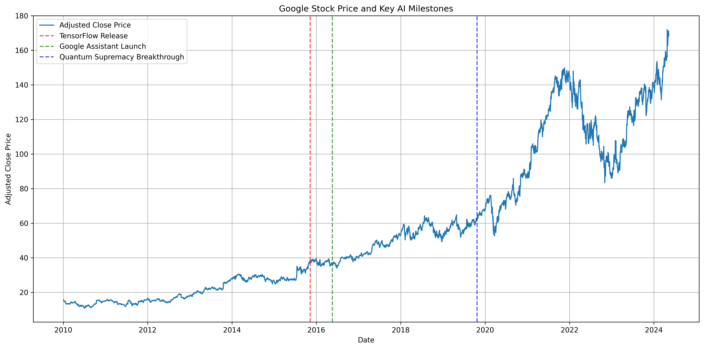
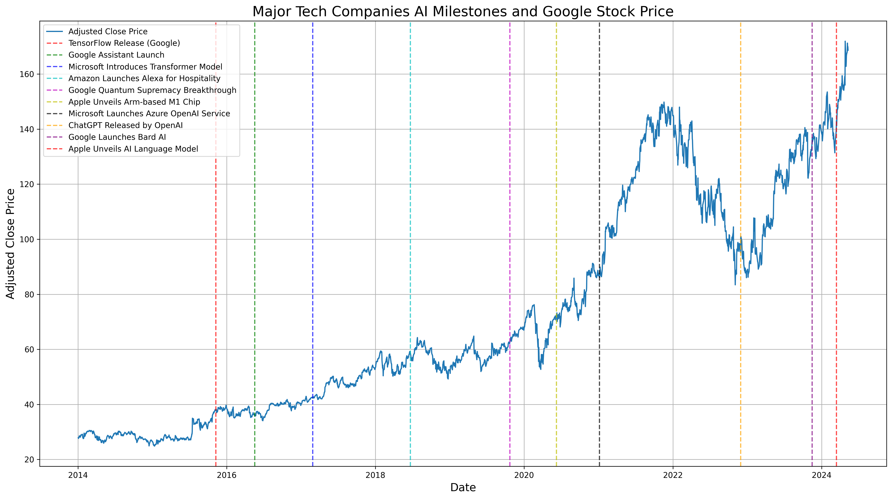

Преди мислех, че интересният въпрос е: движиха ли обещанията на Google за AI цената на акцията?

Това все още е реален въпрос, но е твърде малък. През 2026 по-добрият въпрос е: какъв е действителният AI модел на Google и кои части от него се натрупват с времето?

Историята на Google в AI не е чист героичен разказ. Не е „Google измисли всичко и затова печели“. Не е и „Google изпусна ChatGPT и затова е обречен“. И двете версии са мързеливи. По-полезната е по-разхвърляна и по-практична: Google често създава или усвоява важни изследвания рано, бавно ги вплита в инфраструктура, скрива ги в огромни продукти, спъва се, когато интерфейсът стане публичен и разговорен, после се възстановява, когато работата стане система, а не демонстрация.

Този модел има значение за хората, които строят продукти, защото показва как изследванията се превръщат в продуктова гравитация. Има значение за инвеститорите, защото стойността на Alphabet не е референдум върху едно пускане на модел. И има значение за всеки, който се опитва да разбере AI, защото Google е една от малкото компании, при които четирите слоя се виждат едновременно: frontier research, потребителска дистрибуция, собствен compute и рекламен бизнес, който AI едновременно заплашва и подсилва.

Това е версията на историята с поглед към 2026.

## Кратката версия

Предимството на Google в AI не е един чатбот. То е цикъл:

1. Изследванията създават техники и модели.
2. Инфраструктурата прави тези модели достатъчно евтини, за да работят в абсурден мащаб.
3. Продуктите излагат моделите пред милиарди потребители.
4. Данните от употребата, enterprise търсенето и пазарният натиск финансират следващия инфраструктурен цикъл.

Цикълът е силен. И е крехък. Ако Search отговаря твърде много и изпраща твърде малко трафик към web-а, издателите се ядосват. Ако Gemini сбърка чувствителен image prompt, грешката става публична история за доверие. Ако AI отговорите са твърде скъпи, маржин разказът се влошава. Ако моделите изостават, целият full-stack наратив започва да звучи като таблица, която замазва продуктова празнина.

Затова правилната позиция не е нито поклонение, нито отхвърляне. Google AI е машина за натрупване с много публични режими на провал.

## Кратка хронология

- **2011-2015: вътрешен мащаб преди публичното AI брандиране.** Инфраструктурата DistBelief на Google помогна за вътрешното обучение на големи невронни мрежи. През ноември 2015 Google отвори [TensorFlow](https://research.google/blog/tensorflow-googles-latest-machine-learning-system-open-sourced-for-everyone/), като направи част от вътрешния си machine learning стек достъпен за по-широкия свят.
- **2016: AlphaGo и „AI-first“.** AlphaGo на DeepMind направи AI по-малко лабораторно любопитство и повече нов вид машина за решаване на проблеми. Google също започна да говори за себе си като AI-first компания, а не mobile-first компания.
- **2017: Transformer.** Статията [Attention Is All You Need](https://arxiv.org/abs/1706.03762), от изследователи на Google, въведе Transformer архитектурата, която днес стои под голяма част от модерния generative AI.
- **2019: BERT влиза в Search.** Google приложи BERT модели към ranking-а и featured snippets в Search, използвайки machine learning за по-добро разбиране на езика и намерението зад заявките.
- **2020-2024: науката става доказателство.** AlphaFold показа, че AI може да произвежда научна полезност, не само впечатляващи демонстрации. До 2025 Google DeepMind описваше AlphaFold като петгодишна история на научно въздействие, призната с Нобелова награда.
- **2023: Google DeepMind се формира.** Google обедини DeepMind и Brain екипа в [Google DeepMind](https://blog.google/innovation-and-ai/technology/ai/april-ai-update/), поставяйки повече от model work-а си под една фокусирана изследователска организация.
- **Декември 2023: Gemini започва.** Google представи [Gemini 1.0](https://blog.google/innovation-and-ai/technology/ai/google-gemini-ai/) като първото семейство модели от ерата на Google DeepMind.
- **2024: AI излиза от лабораторията и се чупи публично.** Генерирането на изображения в Gemini беше спряно след неточни изображения на хора, а AI Overviews стартира в Search, преди да произведе серия странни, шумни отговори. Това не беше просто PR шум. То показа трудността да поставиш вероятностни системи в повърхности, на които хората разчитат.
- **2025: inference става инфраструктурна стратегия.** Google обяви Ironwood, своя седмо поколение TPU, като чип, проектиран за ерата на inference.
- **2026: agentic ерата на Gemini.** На I/O 2026 Google рамкира следващата глава около Gemini, Search agents, AI Mode, developer agents и full-stack AI подход. Към юни 2026 това е живата стратегическа рамка.

Тази хронология не е права линия от изобретение към доминация. Тя е линия от изобретение към дистрибуция, с няколко дупки по пътя.

## Какво устоя

Първото нещо, което устоя, е скучното твърдение: историята на Google в AI наистина е дълбока.

Модерно е AI лидерството да се свежда до това кой има най-добрия потребителски чатбот този месец. Това пропуска колко много от настоящата ера е било предварително построено от дългосрочна работа: TensorFlow, TPUs, BERT, Transformers, AlphaGo, AlphaFold, seq2seq модели и навика machine learning да се сервира вътре в продукти с милиарди потребители. Обявяването на сливането с DeepMind през 2023 изрично изброи много от тези неща като общото наследство на DeepMind и Brain.

Второто нещо, което устоя, е инфраструктурата.

През 2024 беше лесно да се говори за AI така, сякаш моделът е продуктът. През 2026 compute слоят е невъзможен за игнориране. Обявяването на Ironwood TPU от Google описа преместване от AI, центриран върху training, към inference в мащаб. По-късно Google Cloud рамкира Ironwood като част от дълга линия custom silicon, която включва TPUs, YouTube video chips и Tensor mobile chips.

Това има значение, защото бъдещето на AI не е само „кой може да обучи най-умния модел?“ То е и „кой може да си позволи да отговори на следващия милиард въпроси?“ Search, Gemini, Workspace, Android, YouTube, Cloud и agents стават по-убедителни, ако Google може да намали цената и latency-то на интелигентността.

Третото нещо, което устоя, е дистрибуцията.

Google може да сложи AI в Search, Gmail, Docs, Maps, Android, Chrome, Pixel, YouTube, Photos и Cloud. Това не гарантира добър продуктов вкус. Означава, че когато една функция заработи, дистрибуцията не е трудната част. На I/O 2026 Google каза, че AI Overviews има над 2.5 милиарда месечно активни потребители, а AI Mode е минал 1 милиард месечни потребители в първата си година. Дори като отчетем саморекламния характер на keynote метриките, мащабът е същината. Посредствена функция в мащаба на Google може да те научи на повече от красива демонстрация без потребители.

Четвъртото нещо, което устоя, е идеята, че Google AI е по-голям от Search ads.

Waymo не е Gemini. AlphaFold не е Search. TPU клиентите не са зрители в YouTube. Но всички стоят под една и съща логика на Alphabet: търпеливи технически залози, на които е позволено да изглеждат странни години наред, преди или да станат продуктова инфраструктура, или да останат скъпа optionality. През Q1 2026 Alphabet каза, че Waymo е надминала 500,000 напълно автономни пътувания седмично. Това все още не е основният бизнес. Но вече не е и реквизит за научен панаир.

## Какво не остаря добре

Старата stock-first рамка не остаря добре.

Реакциите на акцията са реални, но са шумни термометри. Грешката в демото на Bard през 2023 според публикации помогна да се изтрият около 100 милиарда долара от пазарната стойност за един ден. Това беше смущаващо и значимо. То също така не реши бъдещето на Google в AI. Публично демо може да движи sentiment по-бързо, отколкото движи продуктова реалност.

Същото работи и обратно. Силен earnings print не доказва, че всеки AI залог е добър. Доказва, че инвеститорите в този момент са били готови да повярват, че разходът има път към възвръщаемост. Тази разлика има значение.

Второто нещо, което не остаря добре, е идеята, че Google може просто да „ship-ва по-силно“.

Проблемът на Google никога не е бил липса на модели. Той беше сблъсъкът между AI несигурност и доверие в мащаба на Google. Когато генерирането на изображения в Gemini произведе неточни или обидни изображения на хора, Google спря функцията и обясни, че настройката ѝ е свръхкоригирала в някои контексти. Когато AI Overviews произведе странни отговори през 2024, Google обясни, че Search AI е вързан към ranking системи и web резултати, но също призна, че погрешно интерпретирани заявки, тънък source material и сарказъм от форуми все още могат да счупят преживяването.

Тези инциденти не са бележки под линия. Те са продуктовият урок. AI в Google не е само capability. Той е capability под brand натиск, regulatory натиск, publisher натиск и натиск върху доверието на потребителите.

Третото нещо, което не остаря добре, е допускането, че goodwill-ът от open research автоматично ще продължи.

TensorFlow беше огромен open-source момент през 2015. Модерната ера на Gemini е по-смесена: затворени frontier models, отворени Gemma models, API достъп, Cloud услуги и силно управлявани потребителски повърхности. Това може да е търговски рационално. Но означава и че връзката на Google със строителите е по-транзакционна, отколкото беше в момента TensorFlow. Developers не питат само „моделът умен ли е?“ Те питат дали платформата е стабилна, достъпна, преносима и достатъчно скучна, за да строиш върху нея.

## Моделът на Google AI

Ето менталния модел, който сега ми е най-полезен:

**Изследванията са семето.** Google е много добър в произвеждането на research, който по-късно става фундаментален. Transformer е очевидният пример. AlphaFold е по-доброто напомняне, че същата изследователска култура може да има значение извън потребителския софтуер.

**Инфраструктурата е опитът за moat.** TPUs, data centers, networking, cooling и software stacks не са бляскави, но решават дали AI може да се сервира печелившо. През Q1 2026 покупките на Alphabet на property and equipment бяха 35.7 милиарда долара. Това не са просто „AI vibes“; това е твърд капитал, който влиза в servers, network equipment и data centers.

**Продуктите са изпитателният полигон.** Search е опасният, защото печата пари. Cloud е най-чистата бизнес история, защото клиентите плащат директно за compute, models и enterprise AI tooling. Android и Workspace са distribution layers. Gemini е едновременно продукт и brand wrapper около семейството модели.

**Пазарното възприятие е манометърът.** Инвеститорите не оценяват Google AI като изследователи. Те питат по-малък набор въпроси: ще увеличи ли AI употребата на Search или ще канибализира ad clicks? Ще вземе ли Cloud пазарен дял? Ще произведе ли capex revenue, margin или strategic control? Ще избегне ли Google regulatory и reputational грешки?

Когато видиш Google да обявява нов модел, не питай само дали бие benchmark. Питай къде влиза в цикъла.

Прави ли Search по-полезен, без да съсипва web екосистемата? Прави ли Cloud по-лесен за продажба? Намалява ли cost per answer? Подобрява ли Android или Workspace достатъчно, за да го усетят потребителите? Кара ли developers да строят върху Google, вместо само да тестват демото и да си тръгнат?

Това е моделът.

## Gemini е стратегия, не само модел

Gemini започна като семейство модели, но до 2026 е повече като AI operating label на Google.

Има Gemini в app-а. Gemini в Search. Gemini в Workspace. Gemini в Cloud. Gemini в Android. Gemini в developer tools. Gemini като двигател за consumer subscriptions. Gemini като API traffic. Gemini като agentic story.

Това може да е объркващо, защото „Gemini“ върши твърде много семантична работа. Може да означава frontier model, app, API, assistant, branding layer или enterprise story. Но разрастването е и стратегията. Google иска Gemini да бъде съединителната тъкан между повърхности, които преди изглеждаха отделни.

Затова езикът от I/O 2026 има значение. Google не казваше само „нашият модел е по-умен“. Казваше, че AI се движи от assistance към agents, от изолирани prompts към workflows и от chatbot novelty към продуктови повърхности, които хората вече използват.

Внимавам с думата „agentic“, защото тя става новото „blockchain“: понякога смислена, понякога напръскана по slides. Но при Google посоката е достатъчно ясна. Search agents, AI Mode, Antigravity, Gemini API managed agents, Workspace context и Android tooling са все опити моделите да станат системи, които извършват действия.

Тестът не е дали keynote демо изглежда живо. Тестът е дали потребителите се доверяват на agent-а с скучна, повтаряща се, последователна работа.

## Внимателният борсов ъгъл

Акцията на Alphabet не е чиста AI акция. Тя е рекламен, cloud, subscription, infrastructure и optionality актив с огромен AI въпрос вътре.

Това прави пазарния ъгъл по-фин от „AI обявление равно акция нагоре“.

Грешката на Bard през февруари 2023 показа колко бързо sentiment може да накаже Google, когато инвеститорите повярват, че губи наратива срещу Microsoft и OpenAI. Но earnings историята през 2026 показва обратния натиск: ако приходите от Search растат, Cloud ускорява, Gemini subscriptions се покачват и infrastructure demand изглежда реално, инвеститорите могат да станат по-търпеливи към тежките AI разходи.

Числата на Alphabet за Q1 2026 са полезни, защото показват защо пазарът беше готов да слуша. Приходите бяха 109.9 милиарда долара за тримесечието. Google Cloud revenue беше малко над 20 милиарда долара, с 63% ръст на годишна база и operating income от 6.6 милиарда долара. Google каза, че Cloud backlog почти се е удвоил спрямо предходното тримесечие до над 460 милиарда долара. Search and Other advertising нарасна с 19%. Тези числа не доказват, че Google ще спечели AI, но правят bear case-а по-труден.

Най-чистият начин да се чете борсовият ъгъл е този:

- **Кратък срок:** демота, грешки, lawsuits, product launches и езикът в earnings движат sentiment.
- **Среден срок:** Search usage, AI ad formats, Gemini subscriptions, Cloud backlog, TPU demand и capex discipline са по-важни.
- **Дълъг срок:** въпросът е дали Google може да превърне AI от cost shock в product layer, който пази margin-а.

Последната точка е цялата игра. Ако AI прави всяко търсене по-скъпо, докато намалява publisher goodwill и ad clicks, пазарът в крайна сметка ще се заинтересува. Ако AI прави Search по-полезен, Cloud по-диференциран, Workspace по-лепкав и compute по-ефективен, пазарът ще прости много.

<figure>
  
  <figcaption>
    Fig1. - Исторически етапи в акцията на Google от оригиналната статия. Полезен контекст, не live valuation model.
  </figcaption>
</figure>

<figure>
  
  <figcaption>Fig2. - AI етапи при големите технологични компании. Гледай milestone charts като карта на наративи, не като доказателство за трайно предимство.</figcaption>
</figure>

## Какво трябва да научат строителите от Google AI

Урокът за строителите не е „бъди Google“. Няма да имаш Search, YouTube, DeepMind, TPUs, Cloud, Android и data-center budget в side project-а си. Очарователно, но не.

Полезният урок е за последователността.

Първо, research не е product. Model capability става ценна само когато е поставена в workflow, където потребителят вече има intent. Search е силен, защото потребителят идва с intent. Workspace е силен, защото потребителят идва с работа. Cloud е силен, защото клиентът идва с бюджет и deployment problem.

Второ, evals не са достатъчни. Публичните провали на Google често не бяха провали тип „моделът е тъп“. Те бяха context failures, policy failures, retrieval failures, product-surface failures и expectation failures. Ако твоята AI функция докосва доверие, пари, здраве, идентичност, current events или публична репутация, eval suite-ът ти трябва да включва света около модела.

Трето, цената е продуктов дизайн. Функция, която е магическа при $1 на отговор и поносима при $0.01 на отговор, не е същата функция. Обсесията на Google с TPUs, latency и cost per response не е просто финансов разказ. Тя оформя какви продуктови преживявания са възможни.

Четвърто, дистрибуцията може да скрие слабост за известно време, но не може да скрие лоша полезност завинаги. Google може да постави Gemini пред стотици милиони хора. Това му дава време и feedback. Но потребителите все пак забелязват, когато нещо е бавно, грешно, досадно или не си струва да променят навиците си заради него.

## Какво бих следил занапред

Бих следил пет неща.

**Поведението в Search.** AI Overviews и AI Mode са центърът на историята на Google AI, защото Search е бизнес сърцето. Следи дали хората търсят повече, дали commercial queries остават monetizable и дали издателите продължават да захранват web-а, от който AI Overviews зависи.

**Cost per useful answer.** Тихото изречение във всяка AI earnings история е за цената. Ако Google продължи да намалява inference cost, докато model quality се подобрява, distribution advantage-ът му става по-остър.

**Cloud conversion.** Backlog-ът е обещаващ. Revenue и operating income са по-добри. Customer retention и реалните AI workloads са още по-добри. Google Cloud е мястото, където AI историята става най-пряко продаваема.

**Agent reliability.** Agents са лесни за демонстриране и трудни за доверяване. По-малко ме интересува дали agent резервира един ресторант в keynote и повече дали се справя с messy real-world constraints, без да създава cleanup work.

**Failure response.** Google ще прави още AI грешки. Всички ще правят. Истинският сигнал е колко бързо компанията стеснява blast radius-а, обяснява проблема, подобрява системата и устоява на изкушението да се преструва, че проблемът е бил само user misunderstanding.

## Полезният извод

Историята на Google в AI не е comeback story. Не е и fall-from-grace story. Това е дълга история на натрупване с много неловка публична среда.

Какво устоя: дълбочината на research-а, инфраструктурният залог, дистрибуционното предимство и идеята, че AI в крайна сметка ще докосне всяка голяма повърхност на Google.

Какво не остаря добре: да се третират движенията на акцията като доказателство, model launches като съдба и да се подценява колко трудно е да поставиш generative AI в продукти, на които хората очакват да се доверят.

Практичният ментален модел е прост:

Google печели, когато research, infrastructure, product и monetization се подсилват взаимно. Google се спъва, когато един слой изпревари останалите.

Затова борсовият ъгъл трябва да е вторичен. Акцията е само сянката на стената. Истинският обект е цикълът.

## Източници и допълнително четене

- [TensorFlow open-sourced by Google Research](https://research.google/blog/tensorflow-googles-latest-machine-learning-system-open-sourced-for-everyone/)
- [Attention Is All You Need](https://arxiv.org/abs/1706.03762)
- [Google Search and BERT](https://blog.google/products-and-platforms/products/search/search-language-understanding-bert/)
- [Google DeepMind merger announcement](https://blog.google/innovation-and-ai/technology/ai/april-ai-update/)
- [Introducing Gemini 1.0](https://blog.google/innovation-and-ai/technology/ai/google-gemini-ai/)
- [AI Overviews launch in Search](https://blog.google/products-and-platforms/products/search/generative-ai-google-search-may-2024/)
- [Google's AI Overviews post-launch explanation](https://blog.google/products-and-platforms/products/search/ai-overviews-update-may-2024/)
- [Gemini image generation issue explanation](https://blog.google/products-and-platforms/products/gemini/gemini-image-generation-issue/)
- [I/O 2026: agentic Gemini era](https://blog.google/innovation-and-ai/sundar-pichai-io-2026/)
- [Google Search I/O 2026 updates](https://blog.google/products-and-platforms/products/search/search-io-2026/)
- [Google I/O 2026 developer keynote recap](https://developers.googleblog.com/all-the-news-from-the-google-io-2026-developer-keynote/)
- [Alphabet Q1 2026 CEO remarks](https://blog.google/company-news/inside-google/message-ceo/alphabet-earnings-q1-2026/)
- [Alphabet Q1 2026 results filed with the SEC](https://www.sec.gov/Archives/edgar/data/1652044/000165204426000043/googexhibit991q12026.htm)
- [Ironwood TPU announcement](https://blog.google/innovation-and-ai/infrastructure-and-cloud/google-cloud/ironwood-tpu-age-of-inference/)
- [Ironwood TPU general availability and AI Hypercomputer notes](https://cloud.google.com/blog/products/compute/ironwood-tpus-and-new-axion-based-vms-for-your-ai-workloads)
- [AlphaFold five-year impact note](https://deepmind.google/blog/alphafold-five-years-of-impact/)
- [AlphaGo at 10](https://deepmind.google/blog/10-years-of-alphago/)
- [Reuters note on the 2023 Bard market reaction](https://reutersbest.com/reuters-reveals-googles-ai-chatbot-flubs-answer-in-promotional-video-sending-alphabet-shares-down-9/)
