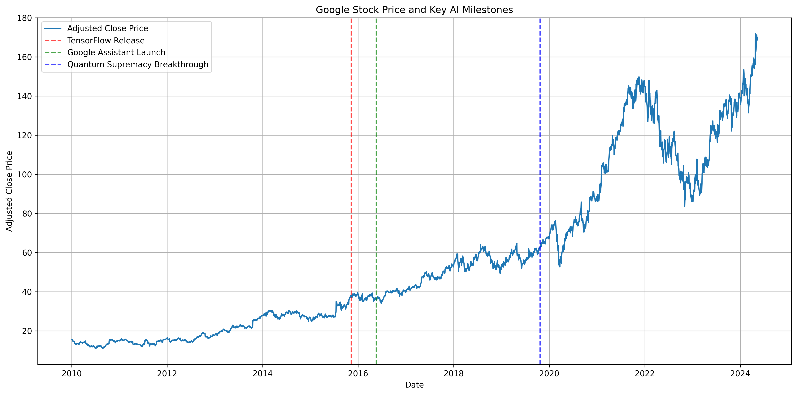
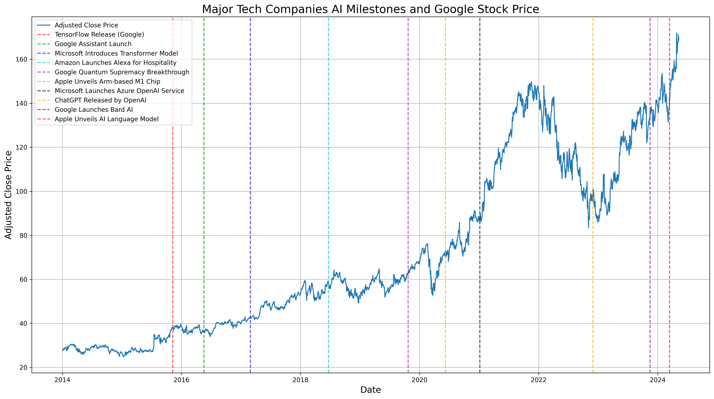

Google's journey through the development and marketing of AI technologies such as the Gemini series
provides a fascinating case study of the interplay between corporate promises, stock market
performance, and technological innovation. This analysis delves into specific historical points
where Google's AI promises have significantly influenced its stock prices, alongside a review of
its successes and failures.

The tech giant's foray into AI has been marked by ambitious projects and bold claims. From the
introduction of TensorFlow in 2015, which established Google as a leader in AI research and
development, to the launch of Google Assistant in 2016, which enhanced its competitiveness against
rivals like Amazon's Alexa and Apple's Siri, Google has consistently aimed to push the boundaries
of AI capabilities <small><a href="#ref1">[1]</a></small>.

### Key Historical Milestones in Google's AI Development

1. **Introduction of TensorFlow (2015)**: Google open-sourced TensorFlow, its machine learning
   framework, which became widely popular. This move helped establish Google as a leader in AI
   research and development, positively impacting its market perception <small><a href="#ref1">[1]</a></small>. TensorFlow has been used
   in various applications, from improving search results to powering self-driving cars.

2. **Launch of Google Assistant (2016)**: The introduction of Google Assistant enhanced Google's
   competitiveness in AI against rivals like Amazon's Alexa and Apple's Siri. This was well-received
   by the market, reflecting potential growth in AI-driven user interfaces <small><a href="#ref2">[2]</a></small>. Google Assistant has
   been integrated into smartphones, smart home devices, and cars, making it a key player in the voice
   assistant market.

3. **Advancements in Quantum Computing (2019)**: Google announced a quantum supremacy breakthrough,
   claiming its quantum computer could perform calculations beyond the capabilities of traditional
   supercomputers. This announcement led to a brief spike in stock prices, showcasing investor
   enthusiasm for Google's cutting-edge technological capabilities <small><a href="#ref3">[3]</a></small>.

### Stock Market Performance and AI Milestones

The stock market has reacted variably to Google's AI developments. Significant announcements, such
as breakthroughs in quantum computing and new AI product launches, typically result in short-term
stock price increases. However, the long-term impact on stock prices has been more closely tied to
the actual deployment and commercial success of these technologies.

- **S&P 500 Milestones**: Google's major AI announcements often coincided with broader market
  trends. For instance, the broader bull market of 2021 saw Google reaching new stock price highs
  alongside significant advancements in AI, reflecting a strong investor confidence in tech-driven
  growth <small><a href="#ref4">[4]</a></small>.

<figure>
  
  <figcaption>
    Fig1. - Google Stock Milestones.
  </figcaption>
</figure>

### Successes and Failures

- **Successes**: Google's AI has achieved considerable success in areas like language translation,
  image recognition, and autonomous driving technology through Waymo. These successes have helped
  solidify Google's reputation as a technology innovator <small><a href="#ref5">[5]</a></small>.

- **Failures**: Not all of Google's AI initiatives have met the market's expectations. For example,
  the much-anticipated Google Glass project failed to resonate with consumers, leading to its
  discontinuation. The product faced privacy concerns and failed to provide a compelling use case for
  the average consumer. Similarly, the delays and overpromises surrounding the Gemini 1.5 Pro have
  led to user dissatisfaction and skepticism <small><a href="#ref6">[6]</a></small>. Google has learned from these failures, focusing on
  more pragmatic AI applications and improving its communication with users.

<figure>
  
  <figcaption>Fig2. - Tech Companies AI Milestones.</figcaption>
</figure>

### Market Impact and Future Outlook

The market impact of Google's AI has been significant, influencing not only its stock prices but also the broader tech industry's direction. The AI sector continues to be a major focus for investors, as seen in the S&P 500's performance, where tech stocks play a substantial role <small><a href="#ref4">[4]</a></small>.

Looking forward, Google's ability to fulfill its AI promises and overcome the challenges of technological deployment will be crucial. The company's strategy to enhance transparency and manage consumer expectations more effectively could determine its future market position and investor trust.

One key area to watch is Google's progress with its Gemini series of AI models. The Gemini 1.5 Pro,
announced in February 2024, promises a significant leap in AI capabilities but has faced challenges
in its rollout <small><a href="#ref6">[6]</a></small>. How Google navigates these challenges and delivers on its promises will likely
have a notable impact on its AI reputation and market standing.

[PLACEHOLDER FOR EXPERT OPINIONS AND INDUSTRY TRENDS ON GOOGLE'S FUTURE AI PLANS]

### Conclusion

Google's AI journey illustrates the complex dynamics of technological innovation, market expectations, and corporate strategy. While the company has experienced both notable successes and setbacks, its ongoing efforts in AI continue to attract significant market attention. Investors and market watchers will likely keep a close eye on Google's ability to leverage its AI capabilities into sustainable growth and market leadership.

As the AI landscape continues to evolve rapidly, Google's position as an AI pioneer will be tested. The company's ability to balance ambitious innovation with realistic execution, transparent communication, and effective expectation management will be critical factors in determining its long-term success in the AI domain and its overall market performance.

### References

1. [Emeritus - Google AI Strategy](https://emeritus.org/blog/ai-strategy-google/)  
2. [Google Blog - Gemini AI](https://blog.google/products/google-one/google-one-gemini-ai-gmail-docs-sheets/)  
3. [Yahoo Finance - GOOGL Quote](https://finance.yahoo.com/quote/GOOGL/)  
4. [Wikipedia - S&P 500 Milestones](https://en.wikipedia.org/wiki/Closing_milestones_of_the_S%26P_500)  
5. [Think with Google - AI Tools](https://www.thinkwithgoogle.com/intl/en-emea/marketing-strategies/automation/using-google-ai-tools/)  
6. [Times of India - Gemini 15 Pro AI Release](https://timesofindia.indiatimes.com/gadgets-news/google-releases-gemini-15-pro-ai-model-heres-what-company-ceo-sundar-pichai-has-to-say/articleshow/107732867.cms)  
